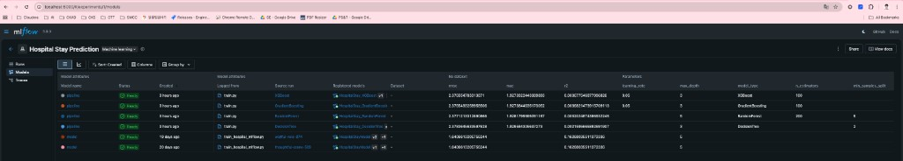
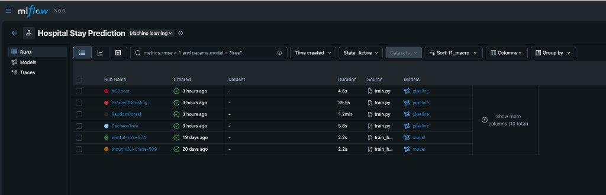
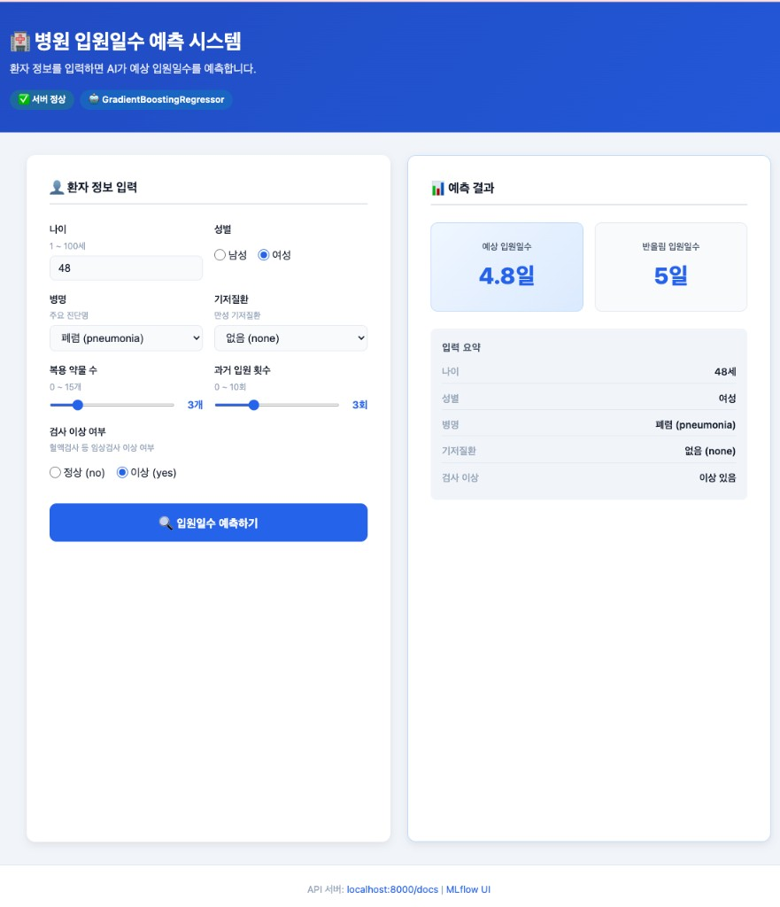
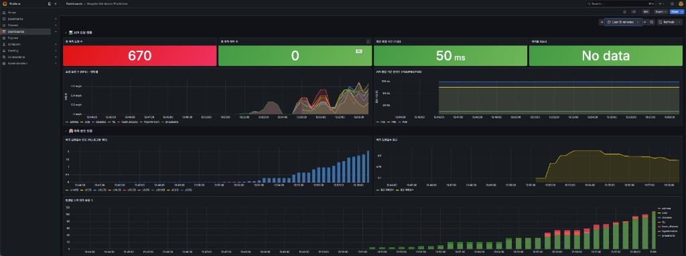
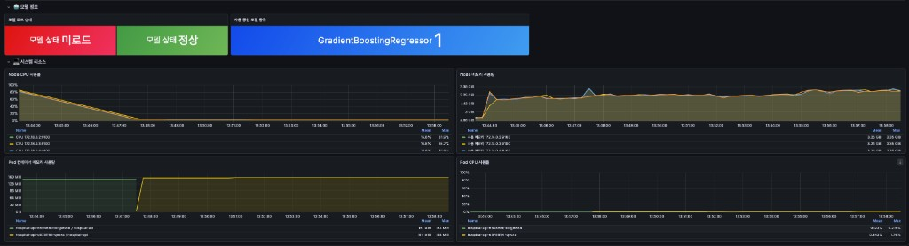

# 병원 입원일수 예측 시스템

환자의 나이, 성별, 병명, 기저질환 등 기본 정보를 입력하면 **예상 입원일수를 자동으로 예측**해주는 머신러닝 시스템입니다.

---

## 이 프로젝트는 무엇인가요?

### 쉽게 말하면

> "이 환자는 병원에 며칠이나 있어야 할까?"를 컴퓨터가 예측하는 시스템입니다.

예를 들어, 55세 남성이 폐렴(pneumonia)으로 입원하고 고혈압 기저질환이 있다면 — 이 시스템은 과거 수많은 환자 데이터를 학습해서 **"약 8일 입원할 것 같다"** 고 예측합니다.

### 왜 만들었나요?

병원에서 입원일수를 미리 예측할 수 있다면:
- 병상(침대) 수를 미리 계획할 수 있습니다
- 의료진과 자원을 효율적으로 배치할 수 있습니다
- 환자와 보호자에게 퇴원 일정을 미리 안내할 수 있습니다

### AI/머신러닝 입문자를 위한 설명

이 프로젝트는 **지도학습(Supervised Learning)** 의 한 종류인 **회귀(Regression)** 를 사용합니다.

| 용어 | 쉬운 설명 |
|------|-----------|
| 지도학습 | 정답이 있는 데이터로 모델을 훈련시키는 방법 |
| 회귀 | 숫자를 예측하는 것 (예: 입원일수 = 8.3일) |
| 피처(Feature) | 예측에 사용하는 입력 정보 (나이, 병명 등) |
| 타겟(Target) | 예측하고 싶은 정답값 (입원일수) |
| 모델 학습 | 수많은 과거 데이터에서 패턴을 찾아내는 과정 |
| 모델 저장 | 학습한 패턴을 파일로 저장해 나중에 재사용 |

### 전체 흐름 한눈에 보기

```
1. 데이터 준비
   실제 환자 데이터가 없으므로 AI(CTGAN)로 가상 데이터 10만 건 생성
          ↓
2. 모델 학습
   4가지 알고리즘으로 학습 후 가장 정확한 모델 자동 선택
          ↓
3. 모델 저장
   학습된 모델을 파일(best_model.pkl)로 저장
          ↓
4. 예측 사용
   저장된 모델로 새로운 환자 정보 → 입원일수 예측
   (CLI / API 서버 / Web UI 중 선택)
```

### 이 프로젝트에서 배울 수 있는 것

- **합성 데이터 생성**: 실제 데이터 없이도 AI로 학습 데이터 만들기 (CTGAN)
- **데이터 전처리**: 범주형(텍스트) 데이터를 숫자로 변환하는 방법 (One-Hot Encoding)
- **모델 비교**: 여러 알고리즘을 자동으로 비교해 최적 모델 선택 (GridSearchCV)
- **실험 추적**: 학습 결과를 기록하고 비교하는 방법 (MLflow)
- **API 서버**: 모델을 웹 서비스로 배포하는 방법 (FastAPI)
- **Web UI**: Python(Streamlit, Gradio)과 TypeScript(React)로 인터페이스 구축
- **프로젝트 구조**: 실제 ML 프로젝트에서 사용하는 폴더 구조와 코드 분리

---

## 시스템 구조

```
FastAPI 백엔드 (포트 8000) ← 공통 예측 API
         ↑
         ├── Streamlit  (포트 8501)  — Python 대시보드
         ├── Gradio     (포트 7860)  — AI 데모 UI
         └── React      (포트 3000)  — 모던 웹앱

MLflow (포트 5000) — 실험 추적 및 모델 관리
```

---

## 시작하기 전에 필요한 것

- Python 3.11
- Node.js 18 이상 (React UI 사용 시)
- Homebrew (macOS 패키지 관리자)

---

## 설치 및 실행 순서

### 0단계. 프로젝트 폴더로 이동

```bash
cd hospital-admission-prediction
```

---

### 1단계. 가상환경 활성화 및 패키지 설치

> 가상환경이란? 이 프로젝트에서만 사용하는 독립적인 Python 공간입니다. 다른 프로젝트와 충돌을 방지합니다.

```bash
# 가상환경 활성화
source .venv/bin/activate

# XGBoost 의존 라이브러리 설치 (macOS 한정)
brew install libomp

# 패키지 설치
pip install -r requirements.txt
```

설치가 완료되면 터미널 프롬프트 앞에 `(.venv)` 표시가 나타납니다.

---

### 2단계. 환경 변수 파일 생성

```bash
cp .env.example .env
```

> `.env` 파일에는 MLflow 서버 주소, 모델 파일 경로 등 설정값이 담깁니다.  
> 기본값 그대로 사용해도 됩니다.

---

### 3단계. 학습용 데이터 생성

실제 환자 데이터 대신, AI(CTGAN)로 합성 데이터를 만들어 학습에 사용합니다.

```bash
python -m src.data.generate
```

> 완료까지 약 5~10분 소요됩니다. (CTGAN 모델 학습 포함)  
> 빠르게 테스트하려면 샘플 수를 줄이세요:
> ```bash
> python -m src.data.generate --n-samples 10000
> ```

완료 후 생성되는 파일:
- `data/raw/seed_data.csv` — 70건의 시드 데이터
- `data/synthetic/hospital_data.csv` — 10만 건의 합성 데이터

---

### 4단계. MLflow 서버 실행

MLflow는 모델 학습 과정과 성능 지표를 기록·비교하는 실험 추적 도구입니다.  
**새 터미널 탭을 열어서** 실행하세요.

```bash
# 새 터미널에서
cd hospital-admission-prediction
source .venv/bin/activate
mlflow server --backend-store-uri sqlite:///mlflow.db --host 0.0.0.0 --port 5000
```

실행 후 브라우저에서 확인: [http://localhost:5000](http://localhost:5000)

---

### 5단계. 모델 학습

원래 터미널로 돌아와서 실행합니다.  
4가지 모델을 자동으로 비교해 가장 좋은 모델을 저장합니다.

```bash
python -m src.models.train
```

학습하는 모델 목록:
| 모델 | 특징 |
|------|------|
| DecisionTree | 단순하고 빠름 |
| RandomForest | 여러 트리를 조합해 정확도 향상 |
| GradientBoosting | 오차를 반복적으로 줄여나감 |
| XGBoost | 대회에서 자주 쓰이는 고성능 모델 |

완료 후:
- `models/best_model.pkl` — 최적 모델 파일 저장
- [http://localhost:5000](http://localhost:5000) 에서 4개 모델 성능 비교 확인 가능

#### MLflow 실험 결과 화면



> **실험 추적 화면**: XGBoost, GradientBoosting, RandomForest, DecisionTree 4개 모델의 학습 결과가 자동으로 기록됩니다.  
> 각 행을 클릭하면 RMSE, MAE, R² 등 상세 지표와 하이퍼파라미터를 확인할 수 있습니다.



> **모델 레지스트리 화면**: 학습된 모델들이 버전별로 관리됩니다.  
> `pipeline` 태그가 붙은 모델은 전처리(StandardScaler + OneHotEncoder)와 예측 모델이 하나로 묶인 파이프라인입니다.

---

### 6단계. 모델 성능 확인 (선택)

```bash
python -m src.models.evaluate
```

아래 3개 그래프가 `reports/figures/` 폴더에 저장됩니다:
- `pred_vs_actual.png` — 예측값 vs 실제값 비교
- `residuals.png` — 오차 분포
- `feature_importance.png` — 어떤 피처가 예측에 중요한지

---

### 7단계. 예측하기

#### 방법 A: 터미널(CLI)로 바로 예측

```bash
python -m cli.predict \
    --age 55 \
    --gender M \
    --diagnosis pneumonia \
    --comorbidity hypertension \
    --num-medications 4 \
    --prior-admissions 2 \
    --lab-result-abnormal yes
```

출력 예시:
```
예측 결과
------------------------------
  나이              : 55세
  성별              : 남성
  병명              : pneumonia
  기저질환          : hypertension
  복용 약물 수      : 4개
  과거 입원 횟수    : 2회
  검사 이상 여부    : yes
------------------------------
  예상 입원일수     : 8.3일 (반올림: 8일)
  사용 모델         : models/best_model.pkl
```

#### 방법 B: API 서버로 예측

**서버 실행** (새 터미널에서):
```bash
uvicorn src.api.main:app --reload --host 0.0.0.0 --port 8000
```

**브라우저에서 테스트**: [http://localhost:8000/docs](http://localhost:8000/docs)

Swagger UI가 열리면 `/predict` 항목에서 값을 입력하고 "Execute" 버튼을 눌러 바로 테스트할 수 있습니다.

**curl로 테스트**:
```bash
curl -X POST http://localhost:8000/predict \
  -H "Content-Type: application/json" \
  -d '{
    "age": 55,
    "gender": "M",
    "diagnosis": "pneumonia",
    "comorbidity": "hypertension",
    "num_medications": 4,
    "prior_admissions": 2,
    "lab_result_abnormal": "yes"
  }'
```

응답:
```json
{
  "predicted_days": 8.3,
  "predicted_days_rounded": 8,
  "input_summary": {
    "age": 55,
    "gender": "M",
    "diagnosis": "pneumonia",
    "comorbidity": "hypertension",
    "lab_result_abnormal": "yes"
  }
}
```

#### 방법 C: Web UI로 예측 (3가지 중 선택)

> FastAPI 서버(방법 B)가 실행 중인 상태에서 아래 중 하나를 실행하세요.

**Streamlit** (포트 8501)
```bash
streamlit run web/streamlit/app.py
```
→ [http://localhost:8501](http://localhost:8501)

**Gradio** (포트 7860)
```bash
python web/gradio/app.py
```
→ [http://localhost:7860](http://localhost:7860)

**React** (포트 3000) — 최초 1회 `npm install` 필요
```bash
cd web/react
npm install
npm run dev
```

서버 시작 완료 시 터미널에 아래와 같이 출력됩니다:
```
──────────────────────────────────────────────────
  🏥  병원 입원일수 예측 Web UI 실행 완료
──────────────────────────────────────────────────
  ➜  Local:    http://localhost:3000/
  ➜  API 서버: http://localhost:8000/docs
  ➜  MLflow:   http://localhost:5000
──────────────────────────────────────────────────
```

| UI | 특징 | 포트 |
|----|------|------|
| Streamlit | Python만으로 대시보드 구성, 사이드바 모델 정보 표시 | 8501 |
| Gradio | AI 데모에 특화, 예시 데이터 클릭으로 자동 입력 | 7860 |
| React | TypeScript 기반 모던 웹앱, 반응형 레이아웃 | 3000 |

#### React UI 화면



> **실제 동작 화면**: 48세 여성 환자, 폐렴(pneumonia), 검사 이상 있음 → **예측 결과 4.8일 (반올림 5일)**

| 영역 | 설명 |
|------|------|
| 상단 헤더 | 서버 연결 상태(✅ 서버 정상)와 현재 로드된 모델 종류(GradientBoostingRegressor) 실시간 표시 |
| 왼쪽 — 환자 정보 입력 | 나이(숫자 입력), 성별(라디오), 병명·기저질환(드롭다운), 약물 수·입원 횟수(슬라이더), 검사 이상 여부(라디오) |
| 오른쪽 — 예측 결과 | 예상 입원일수(소수점)와 반올림 입원일수를 카드로 표시, 입력 요약 테이블 함께 출력 |
| 하단 푸터 | FastAPI 문서(localhost:8000/docs), MLflow UI(localhost:5000) 바로가기 링크 |

---

## 입력 가능한 값 정리

| 항목 | 입력 가능한 값 | 예시 |
|------|--------------|------|
| `age` | 1 ~ 100 (숫자) | `45` |
| `gender` | `M` (남성), `F` (여성) | `M` |
| `diagnosis` | `cold` `flu` `asthma` `pneumonia` `diabetes` `hypertension` `heart_disease` | `flu` |
| `comorbidity` | `none` `diabetes` `hypertension` `heart_disease` `obesity` | `none` |
| `num_medications` | 0 ~ 15 (숫자) | `3` |
| `prior_admissions` | 0 ~ 10 (숫자) | `1` |
| `lab_result_abnormal` | `yes`, `no` | `no` |

---

## 테스트 실행

코드가 올바르게 동작하는지 자동으로 검사합니다.

```bash
pytest tests/ -v
```

---

## 전체 실행 순서 요약

```
[터미널 1]                    [터미널 2]        [터미널 3]           [터미널 4 — 택 1]
가상환경 활성화                MLflow 서버       FastAPI 서버         Web UI
─────────────────────────     ───────────────   ──────────────────   ─────────────────────────────
source .venv/bin/activate  →  mlflow server  →  uvicorn src.api   →  streamlit run web/streamlit/app.py
python -m src.data.generate                     main:app --reload    python web/gradio/app.py
python -m src.models.train                                           cd web/react && npm run dev
python -m cli.predict ...
```

---

## 모니터링 (Grafana + Prometheus on Kubernetes)

API 서버의 요청 수, 응답 시간, 예측값 분포, 모델 상태, 시스템 리소스를 실시간으로 시각화합니다.  
**Docker Desktop의 내장 Kubernetes**와 **Helm**으로 배포합니다.

### 사전 준비

1. **Docker Desktop** → Settings → Kubernetes → "Enable Kubernetes" 활성화 후 Apply & Restart
2. **Helm 설치** (macOS):
   ```bash
   brew install helm
   ```

### 배포 순서

#### 1. Docker 이미지 빌드 (로컬)

```bash
# 프로젝트 루트에서 실행
docker build -t hospital-api:latest .
```

#### 2. kube-prometheus-stack 설치 (Prometheus + Grafana + Node Exporter 한 번에)

```bash
# Helm 저장소 추가
helm repo add prometheus-community https://prometheus-community.github.io/helm-charts
helm repo update

# monitoring 네임스페이스에 설치 (약 2~3분 소요)
helm install kube-prometheus-stack prometheus-community/kube-prometheus-stack \
  --namespace monitoring --create-namespace \
  --values k8s/monitoring/values.yaml
```

#### 3. FastAPI 앱 배포

```bash
# 네임스페이스 + Deployment + Service + ServiceMonitor 순서대로 적용
kubectl apply -f k8s/app/namespace.yaml
kubectl apply -f k8s/app/deployment.yaml
kubectl apply -f k8s/app/service.yaml
kubectl apply -f k8s/app/servicemonitor.yaml
```

#### 4. Grafana 대시보드 등록

```bash
kubectl apply -f k8s/monitoring/dashboard-configmap.yaml
```

#### 5. 접속 주소 확인

| 서비스 | 포트 포워딩 명령 | 접속 주소 |
|--------|----------------|-----------|
| **Grafana** | `kubectl port-forward -n monitoring svc/kube-prometheus-stack-grafana 3000:3000` | http://localhost:3000 |
| **Prometheus** | `kubectl port-forward -n monitoring svc/kube-prometheus-stack-prometheus 9090:9090` | http://localhost:9090 |
| **FastAPI** | `kubectl port-forward -n hospital-prediction svc/hospital-api 8000:80` | http://localhost:8000 |

Grafana 초기 로그인: **ID** `admin` / **PW** `admin123`

### 수집되는 메트릭

| 메트릭 | 종류 | 설명 |
|--------|------|------|
| `hospital_prediction_requests_total` | Counter | 병명별 예측 요청 수 |
| `hospital_prediction_days` | Histogram | 예측 입원일수 분포 |
| `hospital_prediction_errors_total` | Counter | 예측 에러 수 |
| `hospital_model_loaded` | Gauge | 모델 로드 여부 (1=정상) |
| `hospital_model_info` | Gauge | 사용 중인 모델 종류 |
| `http_requests_total` | Counter | HTTP 요청 수 (상태코드별) |
| `http_request_duration_seconds` | Histogram | API 응답 시간 분포 |
| `node_cpu_seconds_total` | Counter | 노드 CPU 사용률 (Node Exporter) |
| `node_memory_*` | Gauge | 노드 메모리 사용량 (Node Exporter) |
| `container_cpu_usage_seconds_total` | Counter | Pod CPU 사용률 |
| `container_memory_working_set_bytes` | Gauge | Pod 메모리 사용량 |

### Grafana 대시보드 구성

자동으로 등록되는 **"Hospital Admission Prediction"** 대시보드에는 4개 섹션이 있습니다:

- **📊 API 요청 현황** — 총 요청 수, 에러 수, 평균 응답시간(P50), 에러율
- **🏥 예측 분포 현황** — 입원일수 히스토그램, 평균 예측일수, 병명별 요청 분포
- **🤖 모델 정보** — 모델 로드 상태, 사용 중인 모델 종류
- **💻 시스템 리소스** — 노드 CPU/메모리, Pod CPU/메모리 사용량

#### 📊 API 요청 현황 대시보드



> **실제 부하 테스트 결과**: 총 670건의 예측 요청이 전송된 상태입니다.
>
> | 패널 | 내용 |
> |------|------|
> | 총 예측 요청 수 (670) | 지금까지 누적된 `/predict` 요청 건수 |
> | 총 예측 에러 수 (0) | 에러 없이 모두 정상 처리됨 |
> | 평균 응답 시간 (50ms) | P50 기준 API 응답 속도 |
> | 초당 요청 수 그래프 | 병명별로 색이 구분된 RPS 추이 (폐렴·당뇨 등 7가지) |
> | 예측 입원일수 분포 | 히스토그램 버킷으로 1일~30일 분포 시각화 |
> | 병명별 누적 요청 수 | 우측 범례에서 각 병명의 누적 비율 확인 |

#### 💻 시스템 리소스 대시보드



> **Kubernetes 노드 및 Pod 리소스 모니터링** 화면입니다.
>
> | 패널 | 내용 |
> |------|------|
> | 모델 상태 (초록: 정상) | `hospital_model_loaded` 게이지 — 1이면 모델 정상 로드 |
> | 사용 모델 (GradientBoostingRegressor) | `hospital_model_info` 레이블로 현재 모델 종류 표시 |
> | Node CPU 사용률 | 4개 Kubernetes 노드 전체의 CPU 사용률 추이 |
> | Node 메모리 사용량 | 노드별 메모리 사용량 (Node Exporter 수집) |
> | Pod 컨테이너 메모리 | hospital-api Pod의 실시간 메모리 사용량 |
> | Pod CPU 사용률 | hospital-api Pod의 실시간 CPU 사용률 |

### 정리 (삭제)

```bash
# FastAPI 앱 삭제
kubectl delete -f k8s/app/

# 모니터링 스택 삭제
kubectl delete -f k8s/monitoring/dashboard-configmap.yaml
helm uninstall kube-prometheus-stack -n monitoring
kubectl delete namespace monitoring hospital-prediction
```

---

## 프로젝트 구조

```
hospital-admission-prediction/
├── data/
│   ├── raw/                  # CTGAN 학습용 시드 데이터 (자동 생성)
│   └── synthetic/            # 생성된 합성 학습 데이터
├── src/
│   ├── data/
│   │   ├── schema.py         # 피처/병명 상수 정의
│   │   └── generate.py       # 합성 데이터 생성 스크립트
│   ├── features/
│   │   └── pipeline.py       # 데이터 전처리 파이프라인
│   ├── models/
│   │   ├── train.py          # 모델 학습 + MLflow 실험 기록
│   │   └── evaluate.py       # 성능 평가 + 그래프 생성
│   └── api/
│       ├── main.py           # FastAPI 서버 (Prometheus 계측 포함)
│       ├── metrics.py        # 커스텀 Prometheus 메트릭 정의
│       ├── schemas.py        # 입력/출력 데이터 형식 정의
│       └── routers/
│           └── predict.py    # /predict 엔드포인트 (메트릭 기록)
├── web/
│   ├── streamlit/
│   │   └── app.py            # Streamlit 대시보드 UI
│   ├── gradio/
│   │   └── app.py            # Gradio 데모 UI
│   └── react/                # React + Vite + TypeScript 웹앱
│       ├── src/
│       │   ├── App.tsx        # 메인 컴포넌트 (상태 관리)
│       │   ├── types/         # TypeScript 타입 정의
│       │   ├── api/           # FastAPI 연동 fetch 함수
│       │   └── components/    # PredictForm, PredictResult
│       ├── vite.config.ts     # Vite 설정 (프록시, URL 출력)
│       └── package.json
├── k8s/
│   ├── app/
│   │   ├── namespace.yaml    # hospital-prediction 네임스페이스
│   │   ├── deployment.yaml   # FastAPI 앱 Deployment
│   │   ├── service.yaml      # ClusterIP Service
│   │   └── servicemonitor.yaml # Prometheus 스크래핑 설정
│   └── monitoring/
│       ├── values.yaml       # kube-prometheus-stack Helm 커스텀 값
│       └── dashboard-configmap.yaml # Grafana 대시보드 자동 등록
├── Dockerfile                # FastAPI 앱 컨테이너 이미지
├── cli/
│   └── predict.py            # 터미널용 예측 스크립트
├── tests/                    # pytest 자동화 테스트
├── models/                   # 저장된 모델 파일 (.pkl)
├── reports/figures/          # 평가 그래프 이미지
├── mlruns/                   # MLflow 실험 기록
├── requirements.txt          # Python 패키지 목록
└── .env.example              # 환경 변수 설정 예시
```
